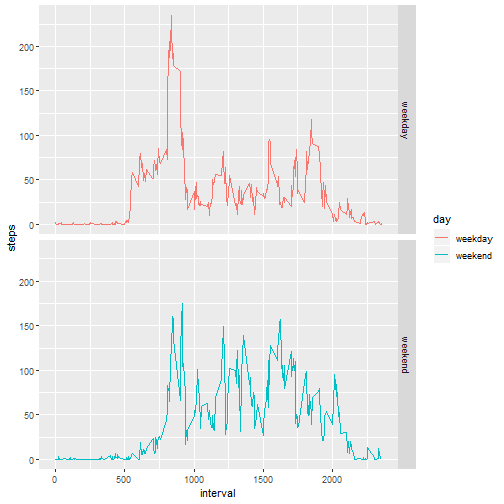

---
output:
  word_document: default
  pdf_document: default
  html_document: default
---
### Reproducible Research Course Assignment 1


###### Load library

```r
library(ggplot2)
```

```
## Warning: package 'ggplot2' was built under R version 3.5.1
```

```r
library(dplyr)
```

```
## Warning: package 'dplyr' was built under R version 3.5.1
```

```
## 
## Attaching package: 'dplyr'
```

```
## The following objects are masked from 'package:stats':
## 
##     filter, lag
```

```
## The following objects are masked from 'package:base':
## 
##     intersect, setdiff, setequal, union
```

###### Read the activity file and store in activity variable

```r
activity <- read.csv("activity.csv")
activity$date <- as.Date(activity$date)
```

###### Part1
###### Calculate the mean total of steps in a day

```r
totStepsPerDay <- aggregate(steps~date, data = activity, sum,
                            na.rm = TRUE)
str(totStepsPerDay)
```

```
## 'data.frame':	53 obs. of  2 variables:
##  $ date : Date, format: "2012-10-02" "2012-10-03" ...
##  $ steps: int  126 11352 12116 13294 15420 11015 12811 9900 10304 17382 ...
```

###### Plot the histogram for total mean steps in a day

```r
hist(totStepsPerDay$steps, xlab = "Total steps", 
                           ylab ="Number of Days",
                            main = "Mean total steps per day")
```


###### Calculate the mean of total steps in a day

```r
meanOfSteps <- mean(totStepsPerDay$steps)
meanOfSteps
```

```
## [1] 10766.19
```


###### Calculate the median of total steps in a day

```r
medianOfSteps <- median(totStepsPerDay$steps)
medianOfSteps
```

```
## [1] 10765
```

###### Part 2
###### Calculate average number of steps taken, averaged across all days


```r
meanStepsPerInterval <- aggregate(steps~interval, data = activity, mean, na.rm = TRUE)
str(meanStepsPerInterval)
```

```
## 'data.frame':	288 obs. of  2 variables:
##  $ interval: int  0 5 10 15 20 25 30 35 40 45 ...
##  $ steps   : num  1.717 0.3396 0.1321 0.1509 0.0755 ...
```

###### Plotting average number of steps taken, averaged across all days


```r
with(meanStepsPerInterval,  plot(interval,steps, type = "l")) 
```


###### Which 5-minute interval, on average across all the days in the dataset, contains the maximum number of steps?


```r
maxInterval <- meanStepsPerInterval[which.max(meanStepsPerInterval$steps),]$interval
maxInterval
```

```
## [1] 835
```
 
###### Part 3
###### Calculate the mean per intervals across all days and store in meanStepsPerIterval
###### Replace the NA values with meanPerInterval and store the entire set as activity2
###### Group steps by date for both activity and activity2

```r
meanStepsPerIterval <- aggregate(steps ~ interval, activity, mean)
activity2 <- transform(activity, steps = ifelse(is.na(activity$steps), 
                    meanStepsPerIterval$steps[match(activity$interval, 
                    meanStepsPerIterval$interval)], activity$steps))
stepsPerDayWithNa = aggregate(steps~date, activity, sum)
stepsPerDayWithoughtNa = aggregate(steps~date, activity2, sum)

summary(stepsPerDayWithoughtNa)
```

```
##       date                steps      
##  Min.   :2012-10-01   Min.   :   41  
##  1st Qu.:2012-10-16   1st Qu.: 9819  
##  Median :2012-10-31   Median :10766  
##  Mean   :2012-10-31   Mean   :10766  
##  3rd Qu.:2012-11-15   3rd Qu.:12811  
##  Max.   :2012-11-30   Max.   :21194
```

###### Potting the histogram of steps per day after replacing NA's 

```r
hist(stepsPerDayWithNa$steps, xlab = "Steps", ylab = "Frequency", col = "orange",
    main = paste("Frequency of steps per day after replacing NA values"))
```


###### To see the difference, will plot two more graphs
###### First one will plot "Sum of steps per day withought NA" (g1)
###### Second one will plot "Sum of steps per day with NA" (g2)
###### If we examine two graphs, we can see empty spaces in g2 due to NA's


###### Plot the graph g1 : Sum of steps per day withought NA


```r
g1 <- ggplot(data = stepsPerDayWithoughtNa, aes(date, steps))
g1 <- g1 + geom_bar(stat = "identity", color = "orange", width = .1)
g1 <- g1 + labs(xlab = "Date", ylab = "Steps")
g1 <- g1 + labs(title = "Sum of steps per day withought NA")
print(g1)
```


###### Plot the graph g2 : Sum of steps per day with NA

```r
g2 <- ggplot(data = stepsPerDayWithNa, aes(date, steps))
g2 <- g2 + geom_bar(stat = "identity", color = "green", width = .1)
g2 <- g2 + labs(xlab = "Date", ylab = "Steps")
g2 <- g2 + labs(title = "Sum of steps per day with NA")
print(g2)
```


###### Part 4
###### Create a new factor variable for storing a day as "weekday" or "weekend"

```r
activity2 <- activity
activity2 <- mutate(activity2,  day = ifelse( weekdays(activity2$date) == "Saturday"|
                                 weekdays(activity2$date) == "Sunday",
                                 "weekend",
                                 "weekday"))  
```

```
## Warning: package 'bindrcpp' was built under R version 3.5.1
```

###### Create a time series plot for 5 minute interval and average number of steps taken on weekend or weekday

```r
meanWeekDayEnd <- aggregate(steps~day+interval, activity2, mean)
g <- ggplot(data = meanWeekDayEnd, aes(interval,steps, color = day))
g <- g + geom_line() + facet_grid(day~.)
print(g)
```



